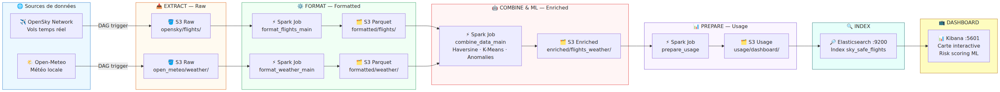
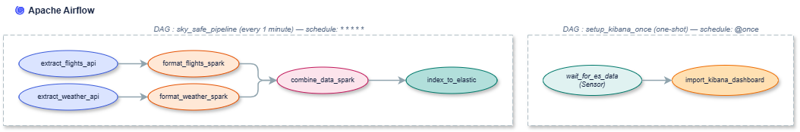
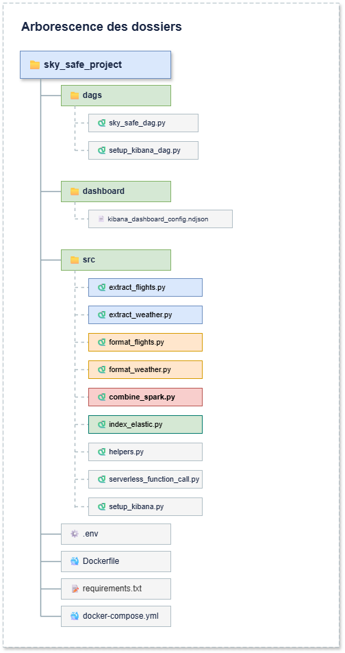

<div align="center">
  <h1>✈️ SkySafe — Flight & Weather Risk Analytics</h1>
  <p><b>Pipeline Big Data temps réel avec Machine Learning pour la surveillance du trafic aérien français.</b></p>
  <p>
    
    
    
    
    
    
    
    
  </p>

  <p>
    <a href="index.md"><strong>📖 Lire l'article complet (Blog Post)</strong></a>
  </p>
</div>

<br>

> **Projet réalisé par [Tahiana Hajanirina Andriambahoaka](https://github.com/tahianahajanirina), [Mohamed Amar](https://github.com/mohamedbebay1-sys) et [Lounis Hamroun](https://github.com/lounishamroun)**
> dans le cadre du cours *DATA705 — BDD NoSQL* à Télécom Paris · Février 2026

---

## À propos du projet

**SkySafe** est une plateforme Big Data qui ingère **toutes les minutes** les positions GPS des avions survolant la France, les croise avec la météo locale, et produit :

1. Un **Score de Risque** (0–100) basé sur les normes aéronautiques FAA (orages, vent, visibilité, altitude…)
2. Une **classification automatique** de la phase de vol (Décollage / Croisière / Montée-Descente) via **K-Means** (Spark MLlib)
3. Une **détection d'anomalies** comportementales (vols dont la cinématique s'écarte de leur groupe)

Le tout est exposé sur un **dashboard Kibana interactif** avec carte, graphiques et filtres — rafraîchi toutes les minutes.


---

## Fonctionnalités clés

| Fonctionnalité | Description |
|---|---|
| **Machine Learning (K-Means)** | Classification non-supervisée des phases de vol via PySpark MLlib. Mécanisme hybride : K-Means quand le trafic est hétérogène, **fallback automatique sur des règles métier aéronautiques** quand les données sont homogènes (ex. la nuit). |
| **Détection d'anomalies** | Distance euclidienne au centroïde du cluster. Seuil dynamique μ + 2σ → identifie les ~5 % de vols les plus atypiques. |
| **Score de risque FAA** | Score composite 0–100 croisant météo + altitude + cinématique, basé sur les recommandations officielles de la FAA. |
| **Cloud Serverless** | Proxy Lambda (Scaleway) contournant le blocage d'IP AWS par OpenSky. |
| **Data Lake S3** | Architecture Medallion 4 couches (`raw` → `formatted` → `enriched` → `usage`) sur Amazon S3. |
| **Auto-Provisioning Kibana** | Un DAG Airflow dédié importe automatiquement le dashboard au premier lancement (zéro config manuelle). |
| **Full Docker** | 6 services conteneurisés, lancement en une seule commande. |

---

## Architecture du Pipeline

Le pipeline suit le modèle `Raw → Formatted → Enriched → Usage`, orchestré par **Apache Airflow** avec une exécution toutes les minutes :

```text
  extract_flights ──► format_flights_spark ──┐
                                              ├──► combine_data_spark ──► index_to_elastic
  extract_weather ──► format_weather_spark ──┘
```

Les deux branches d'extraction s'exécutent **en parallèle**. La jointure spatiale + ML ne démarre qu'une fois les deux formatages terminés avec succès.

### Détail des 4 étapes

| Étape | Couche S3 | Description |
|---|---|---|
| **1. Extract** | `raw/` | Ingestion JSON depuis l'API **OpenSky** (via proxy Serverless Scaleway) et l'API **Open-Meteo** (6 stations météo françaises). |
| **2. Format** | `formatted/` | Nettoyage PySpark : typage, filtrage des vols sans GPS, normalisation des horodatages en **UTC**, conversion en **Parquet**. |
| **3. Combine & ML** | `enriched/` | **Jointure spatiale** (formule de Haversine) vols × station météo la plus proche. Calcul du **Score de Risque** (0–100). Entraînement **K-Means** pour classifier les phases de vol, avec **fallback automatique** sur des règles métier quand le trafic est homogène. **Détection d'anomalies** par distance euclidienne au centroïde (seuil μ + 2σ). |
| **4. Index** | `usage/` | Sélection des colonnes dashboard, fusion lat/lon en `geo_point`, indexation **bulk** dans Elasticsearch (upsert par ICAO24 → pas de doublons). |



---

## Stack technique

| Composant | Technologie | Rôle |
|---|---|---|
| Orchestration | **Apache Airflow 2.7** | Planification du pipeline toutes les minutes (`* * * * *`), gestion des dépendances et retry automatique |
| Traitement | **Apache Spark (PySpark)** | Nettoyage, jointure spatiale (Haversine), score de risque — 100% expressions natives Spark (pas de UDF Python) |
| Machine Learning | **Spark MLlib** | K-Means, StandardScaler, VectorAssembler, Pipeline — classification de phases + détection d'anomalies |
| Stockage | **Amazon S3** | Data Lake cloud, architecture Medallion 4 couches, partitionnement `date=YYYY-MM-DD/hour=HH` |
| Indexation | **Elasticsearch 8.10** | Indexation temps réel avec mapping typé (`geo_point`, `keyword`, `float`, `boolean`, `date`) |
| Visualisation | **Kibana 8.10** | Dashboard interactif : carte, histogrammes, pie chart des phases, tableau filtrable |
| Serverless | **Scaleway Functions** | Proxy Lambda contournant le ban IP d'OpenSky sur AWS |
| Infrastructure | **Docker & Docker Compose** | 6 conteneurs, healthchecks, démarrage en une commande |
| Base Airflow | **PostgreSQL 13** | Métadonnées et état des DAGs Airflow |

---

## Sources de données

### OpenSky Network (vols en temps réel)

L'API [OpenSky Network](https://openskynetwork.github.io/opensky-api/rest.html) fournit la position de chaque avion équipé d'un transpondeur ADS-B au-dessus de la France : ICAO24, callsign, latitude, longitude, altitude, vitesse, cap, taux vertical, pays d'origine.

> ⚠️ OpenSky bloque les IPs des hyperscalers (AWS, GCP…). Notre solution : un **proxy Serverless Scaleway** qui interroge l'API depuis une IP non bloquée.

### Open-Meteo (météo locale)

L'API [Open-Meteo](https://open-meteo.com/en/docs) fournit les conditions météo actuelles pour **6 stations** couvrant la France : Paris CDG, Toulouse, Lyon, Marseille, Nantes, Lille. Variables : température, vent, rafales, pluie, visibilité, couverture nuageuse, code météo (dont orages).

Chaque avion est associé à la station la plus proche via la **formule de Haversine** (distance sur la sphère terrestre).

---

## Machine Learning — En bref

### Classification des phases de vol (K-Means)

Un modèle **K-Means** (k=3) est entraîné à chaque cycle sur les vecteurs normalisés `(velocity, baro_altitude, vertical_rate)`. Les 3 clusters correspondent à :

| Cluster | Phase de vol |
|---|---|
| Altitude basse, vitesse faible | **Takeoff / Landing** |
| Altitude variable, fort taux vertical | **Climb / Descent** |
| Haute altitude, vitesse élevée, taux ~0 | **Cruise** |

**Mécanisme hybride :** si les centroïdes sont trop proches (distance max < 1.0 en espace normalisé), le K-Means est jugé non significatif et le pipeline bascule automatiquement sur des **règles métier aéronautiques** (seuils d'altitude, vitesse, taux vertical).

### Détection d'anomalies

La **distance euclidienne** entre chaque avion et le centroïde de son cluster constitue l'`anomaly_score`. Un vol est marqué anomalie si son score dépasse le seuil dynamique **μ + 2σ** (~5 % des vols les plus atypiques).

---

## Dashboard Kibana

Le dashboard est importé **automatiquement** au premier lancement via un DAG dédié (`setup_kibana_once`) qui attend l'arrivée des données dans Elasticsearch.

**Visualisations disponibles :**

- **Carte interactive** — Position de chaque avion avec code couleur selon le niveau de risque (vert / orange / rouge)
- **Répartition des phases de vol** — Diagramme circulaire : Cruise, Takeoff/Landing, Climb/Descent
- **Distribution des scores** — Histogrammes du risk score et de l'anomaly score
- **Tableau détaillé** — Callsign, pays, altitude, vitesse, score de risque, phase de vol, statut d'anomalie — filtrable et triable
- **Mise en évidence des anomalies** — Les vols atypiques détectés par le ML sont mis en avant

---

## Infrastructure Docker

L'ensemble du projet est conteneurisé via **Docker Compose** (6 services) :

| Service | Image | Port | Rôle |
|---|---|---|---|
| `postgres` | `postgres:13` | — | Base de données interne d'Airflow |
| `airflow-init` | Custom (Airflow 2.7.1 + Java 11 + JARs Hadoop S3) | — | Migration BDD + création utilisateur admin |
| `airflow-webserver` | Custom | `8090` | Interface web Airflow |
| `airflow-scheduler` | Custom | — | Planificateur (déclenche le DAG toutes les minutes) |
| `elasticsearch` | `elasticsearch:8.10.2` | `9200` | Moteur de recherche et base de données finale |
| `kibana` | `kibana:8.10.2` | `5601` | Dashboard de visualisation |

**Points notables :**
- **Java 11** est installé dans le Dockerfile pour PySpark
- Les **JARs Hadoop AWS** (`hadoop-aws-3.3.4` + `aws-java-sdk-bundle-1.12.262`) permettent à Spark de lire/écrire sur S3 via le protocole `s3a://`
- Les volumes Docker montent `dags/`, `src/` et `data/` en temps réel — toute modification du code est appliquée sans rebuild
- Des **healthchecks** et `depends_on` orchestrent l'ordre de démarrage des services

---

## Sécurité

**Aucun secret n'est exposé dans le code source.** Toutes les données sensibles sont externalisées dans un fichier `.env` (exclu du dépôt via `.gitignore`) :

| Variable | Description |
|---|---|
| `POSTGRES_USER` / `POSTGRES_PASSWORD` | Credentials PostgreSQL |
| `AIRFLOW__CORE__FERNET_KEY` | Clé de chiffrement des connexions Airflow |
| `AIRFLOW__CORE__SECRET_KEY` / `AIRFLOW__WEBSERVER__SECRET_KEY` | Clés JWT partagées webserver/scheduler |
| `AIRFLOW_ADMIN_USER` / `AIRFLOW_ADMIN_PASSWORD` | Identifiants de l'utilisateur Airflow |
| `AWS_ACCESS_KEY_ID` / `AWS_SECRET_ACCESS_KEY` | Credentials AWS pour l'accès S3 |
| `SKY_NETWORK_CLIENT_ID` / `SKY_NETWORK_CLIENT_SECRET` | Credentials OAuth2 OpenSky Network |

---

## Guide de démarrage

### 1. Prérequis

- [Docker](https://www.docker.com/) et [Docker Compose](https://docs.docker.com/compose/) installés
- Au moins **6 Go de RAM** alloués à Docker (Spark + Elasticsearch)
- Un compte AWS avec un bucket S3 configuré
- Un compte [OpenSky Network](https://opensky-network.org/) (gratuit)

### 2. Cloner le dépôt

```bash
git clone https://github.com/tahianahajanirina/skysafe-datalake.git
cd skysafe-datalake
```

### 3. Configurer les secrets (`.env`)

Créez un fichier `.env` à la racine du projet avec vos credentials :

```env
# === PostgreSQL ===
POSTGRES_USER=airflow
POSTGRES_PASSWORD=changeme
POSTGRES_DB=airflow

# === Airflow ===
# Générer une Fernet key : python -c "from cryptography.fernet import Fernet; print(Fernet.generate_key().decode())"
AIRFLOW__CORE__FERNET_KEY=CHANGE_ME_GENERATE_A_REAL_FERNET_KEY
AIRFLOW__CORE__SECRET_KEY=CHANGE_ME_USE_A_LONG_RANDOM_STRING
AIRFLOW__WEBSERVER__SECRET_KEY=CHANGE_ME_USE_A_LONG_RANDOM_STRING
AIRFLOW_ADMIN_USER=admin
AIRFLOW_ADMIN_PASSWORD=CHANGE_ME

# === OpenSky Network ===
SKY_NETWORK_BASE_URL=https://opensky-network.org/api
SKY_NETWORK_TOKEN_URL=https://auth.opensky-network.org/auth/realms/opensky-network/protocol/openid-connect/token
SKY_NETWORK_CLIENT_ID=CHANGE_ME
SKY_NETWORK_CLIENT_SECRET=CHANGE_ME

# === Amazon S3 ===
AWS_ACCESS_KEY_ID=CHANGE_ME
AWS_SECRET_ACCESS_KEY=CHANGE_ME
AWS_DEFAULT_REGION=eu-north-1
```

### 4. Lancer le projet

```bash
MY_UID=$(id -u) docker-compose up -d --build
```

### 5. Accéder aux interfaces

| Interface | URL |
|---|---|
| **Airflow** (UI web) | [http://localhost:8090](http://localhost:8090) |
| **Kibana** (Dashboard) | [http://localhost:5601](http://localhost:5601) |
| **Elasticsearch** (API) | [http://localhost:9200](http://localhost:9200) |

Le DAG `sky_safe_pipeline` démarre automatiquement et s'exécute toutes les minutes. Le dashboard Kibana est importé automatiquement dès que les premières données arrivent dans Elasticsearch.



### 6. Arrêter le projet

```bash
docker-compose down
```

Pour supprimer les données Elasticsearch persistantes :

```bash
docker-compose down -v
```

---

## 📁 Structure du projet



<details>
<summary>📝 Détail des fichiers principaux</summary>

| Fichier | Rôle |
|---|---|
| `dags/sky_safe_dag.py` | DAG principal — pipeline exécuté toutes les minutes |
| `dags/setup_kibana_dag.py` | DAG one-shot — import automatique du dashboard Kibana |
| `src/helpers.py` | Utilitaires partagés (S3, Spark, logging, config) |
| `src/extract_flights.py` | Extraction des vols (OpenSky via Lambda Scaleway) |
| `src/extract_weather.py` | Extraction météo (Open-Meteo, 6 stations) |
| `src/format_flights.py` | Nettoyage + normalisation UTC des vols (Spark → Parquet) |
| `src/format_weather.py` | Nettoyage + normalisation UTC de la météo (Spark → Parquet) |
| `src/combine_spark.py` | Jointure Haversine + Score de Risque + K-Means + Anomalies |
| `src/index_elastic.py` | Couche Usage + Bulk indexation Elasticsearch |
| `src/setup_kibana.py` | Import du dashboard Kibana via API Saved Objects |
| `src/serverless_function_call.py` | Client d'appel vers la Lambda Scaleway |
| `src/dashboard/kibana_dashboard_config.ndjson` | Configuration exportée du dashboard Kibana |
| `docker-compose.yml` | Orchestration des 6 conteneurs |
| `Dockerfile` | Image custom Airflow + Java 11 + JARs Hadoop S3 |
| `index.md` | Article / Blog Post détaillé du projet |

</details>

---

## Tests

Le projet inclut **42 tests** couvrant les fonctions critiques du pipeline :

| Fichier | Ce qui est testé |
|---|---|
| `test_format_flights.py` | Helpers pure-Python : `_safe_get`, `_to_float`, `_clean_callsign` |
| `test_haversine.py` | Expression Spark Haversine (distances réelles, symétrie) |
| `test_risk_score.py` | Score de risque composite + catégorisation LOW / MEDIUM / HIGH |
| `test_index_elastic.py` | Transformation `_row_to_es_doc` + mapping Elasticsearch |

```bash
# En local (les tests Spark sont auto-skippés si Java n'est pas installé)
pip install -r requirements.txt pytest
pytest

# Via Docker (tous les tests passent, Java inclus dans l'image)
docker compose run --rm airflow-worker pytest
```

---

## Documentation complète

Pour une description détaillée du projet — choix techniques, obstacles rencontrés, explication du Machine Learning, et leçons apprises — consultez notre article complet :

👉 **[Lire le Blog Post](https://tahianahajanirina.github.io/skysafe-datalake/)**

---

## Auteurs

| | Nom | GitHub |
|---|---|---|
| 👨‍💻 | **Tahiana Hajanirina Andriambahoaka** | [@tahianahajanirina](https://github.com/tahianahajanirina) |
| 👨‍💻 | **Mohamed Amar** | [@mohamedbebay1-sys](https://github.com/mohamedbebay1-sys) |
| 👨‍💻 | **Lounis Hamroun** | [@lounishamroun](https://github.com/lounishamroun) |

---

<div align="center">
  <sub>Projet SkySafe — DATA705 BDD NoSQL — Télécom Paris — Février 2026</sub>
</div>